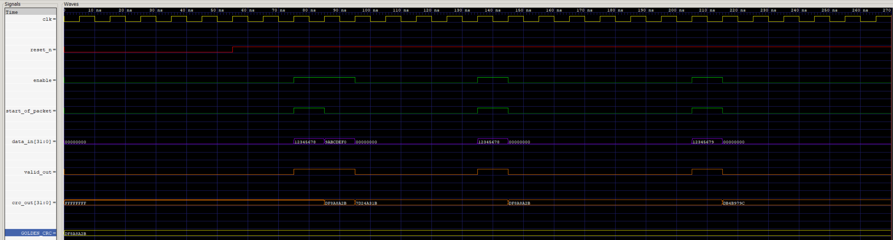

# High-Performance Parallel Pipeline CRC32 Accelerator

## 1. Introduction
This project implements a high-speed, hardware-based **CRC32 (Cyclic Redundancy Check)** accelerator using SystemVerilog.  
Unlike traditional serial implementations that process one bit per cycle, this design utilizes a **parallel architecture** to process **32-bit data chunks per clock cycle**.

The CRC computation is compatible with the Ethernet CRC32 definition (IEEE 802.3), using LSB-first logic and standard initialization/finalization.  
By utilizing a bit-reversed polynomial internally (`0xEDB88320`), the engine achieves maximum throughput without requiring complex manual bit-reversal logic at the I/O.

---

## 2. Key Features
- **Parallel Processing:** Computes CRC for full 32-bit words in a single clock cycle using a combinational XOR loop.
- **Single-Stage Pipeline:** Includes an input sampling stage to decouple timing paths from the input source and improve maximum clock frequency (Fmax).
- **Standard Compliance:** Verified against the IEEE 802.3 Golden Vector  
  (`0x12345678 → 0xAF6D87D2`).
- **Zero-Wait Operation:** Supports back-to-back packet processing.
- **Protocol Assertions:** Built-in SystemVerilog immediate assertions detect illegal signaling.

---

## 3. Architecture Overview
The design implements a high-efficiency CRC calculation engine with **one clock cycle of internal latency**.


### 3.1 Input Sampling Stage
All inputs (`data_in`, `enable`, `start_of_packet`, `last_word`) are captured into internal pipeline registers on the rising edge of `clk`.  
This isolates the combinational XOR logic from external input timing paths and ensures clean signal timing.

### 3.2 CRC Calculation Engine
The core logic emulates a **parallel Linear Feedback Shift Register (LFSR)**:

- **Logic:** A combinational `for` loop computes the next CRC state from the current state and incoming 32-bit data.
- **Polynomial:** Uses the Ethernet generator polynomial in reversed form (`0xEDB88320`).
- **Initialization:** On `start_of_packet`, the CRC register is preset to `0xFFFFFFFF`.
- **Finalization:** The internal CRC state is bitwise inverted (`~`) before driving `crc_out`.

---

## 3.3 Pipeline & Latency Profile
The CRC engine operates as a streaming datapath with registered inputs and a registered CRC state, resulting in a single-cycle latency.

### Latency Summary
- **Throughput:** 32 bits per clock cycle
- **Latency:** 1 clock cycle
- **Output timing:** `valid_out` asserted one cycle after `last_word`
- **Back-to-back frames:** Fully supported


### Textual Pipeline Diagram
```text
Cycle N:
  enable = 1
  data_in = Wk
  start_of_packet / last_word asserted
  └── Inputs captured into pipeline registers

Cycle N+1:
  └── LFSR_Q updated with LFSR_NEXT (when enable asserted)
  └── crc_out = ~LFSR_Q
  └── valid_out asserted
```

## 3.4 Scaling to Higher Frequencies (Deeper Pipelining)

The current implementation computes the full 32-bit CRC update in a single combinational cycle. For higher clock frequency targets (Fmax), the pipeline can be extended as follows:

### Option A: Multi-Stage Bit Processing
- Split the 32-bit update loop into multiple pipeline stages (e.g., 8+8+8+8 bits).
- Insert registers between stages to shorten the critical path.
- **Trade-off:** Latency increases proportionally to the number of stages added.

### Option B: Matrix-Based CRC Computation
- Replace the iterative loop with a precomputed linear transformation matrix.
- This approach allows for logic optimization that is often faster than a deep `for` loop in FPGA/ASIC synthesis.
- next_crc is computed as a fixed XOR network derived from CRC linearity


## 4. Interface Description

| Signal Name | Direction | Width | Description |
| :--- | :--- | :--- | :--- |
| **clk** | Input | 1-bit | **System Clock**. All internal logic and pipeline stages trigger on the rising edge. |
| **reset_n** | Input | 1-bit | **Asynchronous Active-Low Reset**. Forces the CRC state to 0xFFFFFFFF and clears all control registers. |
| **enable** | Input | 1-bit | **Clock Enable**. Data is only sampled and processed by the engine when this signal is high. |
| **start_of_packet** | Input | 1-bit | **Sync Signal**. Resets the internal LFSR to the initialization value for a new frame. |
| **last_word** | Input | 1-bit | **End of Frame Indicator**. Marks the final data word; triggers the calculation finalization. |
| **data_in** | Input | 32-bit | **Data Payload**. The 32-bit word to be processed in the current clock cycle. |
| **crc_out** | Output | 32-bit | **CRC Result**. The final calculated, bit-reversed, and inverted checksum. |
| **valid_out** | Output | 1-bit | **Result Ready**. Indicates `crc_out` contains a valid result (asserted 1 cycle after `last_word`). 

## 5. Verification & Simulation
The project includes a comprehensive, self-checking SystemVerilog Testbench (`tb_crc32.sv`) covering:
* **Pipeline Latency:** Verifies the 1-cycle delay between input data and valid output.
* **Standard Compliance:** Validated against standard models using the Golden Vector `0x12345678`.
* **Randomized Traffic:** Automated testing with varying packet lengths and random data.
The reference model in the testbench matches the RTL bit-for-bit,
ensuring functional equivalence across all tested scenarios.

### Simulation Waveform Analysis



**Analysis of Results:**
1. **Standard Compliance:** When `data_in` is `0x12345678`, the output `0xAF6D87D2` appears exactly one cycle later, matching the reference model and the IEEE 802.3 requirements.
2. **Avalanche Effect:** A single bit change in the input (e.g., from `0x12345678` to `0x12345679`) results in a completely different CRC, proving the error detection strength and "Avalanche Effect" of the implementation.

## 6. File Description
* `CRC32_parallel_pipeline.sv`: The synthesizable RTL design module.
* `tb_crc32.sv`: Self-checking testbench with automated scoreboard and error reporting.

## 7. Tools Used
* **Language:** SystemVerilog (IEEE 1800-2012)
* **Simulation:** Icarus Verilog (iverilog)
* **Waveform Analysis:** GTKWave

## 8. How to Run Simulation
```bash
# 1. Compile the design and testbench
iverilog -g2012 -o crc_sim tb_crc32.sv CRC32_parallel_pipeline.sv

# 2. Run the simulation
vvp crc_sim

# 3. View Waveforms
gtkwave waves.vcd